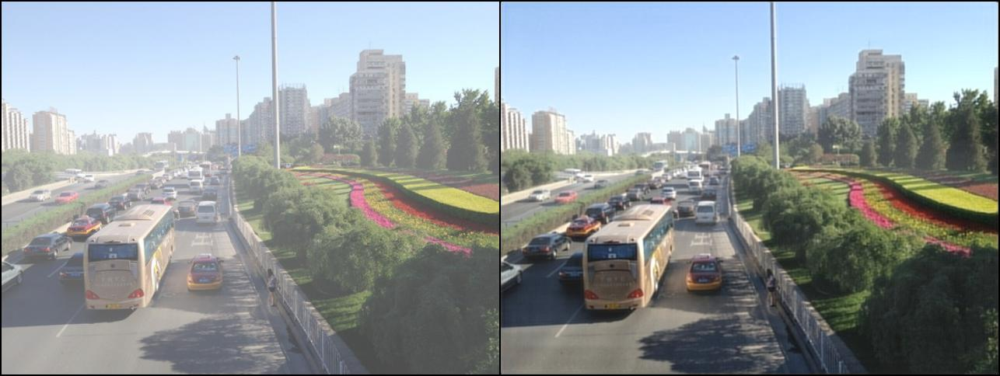

# Wavelet U-net Dehazing
WAVELET U-NET AND THE CHROMATIC ADAPTATION TRANSFORM FOR SINGLE IMAGE DEHAZING - ICIP 2019

This repository shows implementation of [Wavelet U-net for image dehazing](https://ieeexplore.ieee.org/document/8803391). This work establishes the new network combining wavelet transrom for single image dehazing. We use [RESIDE](https://sites.google.com/view/reside-dehaze-datasets/reside-v0)dataset for evaluation, and it outperforms the state-of-art algorithms.

<p align="center"></p>

## Paper
[WAVELET U-NET AND THE CHROMATIC ADAPTATION TRANSFORM FOR SINGLE IMAGE DEHAZING](https://ieeexplore.ieee.org/document/8803391) <br/>
[Hao-Hsiang Yang](https://www.linkedin.com/in/%E7%9A%93%E7%BF%94-%E6%A5%8A-155440164/)<sup> 1,2</sup>, [Yanwei Fu](https://yanweifu.github.io/)<sup> 2</sup> <br/>
<sup>1 </sup>Graduate Institute of Electrical Engineering, National Taiwan University, Taipei, Taiwan, <sup>2 </sup>School of Data Science, Fudan University, Shanghai, China<br/>
 IEEE International Conference on Image Processing ([ICIP](http://2019.ieeeicip.org/)), 2019 
<br/>

## Dependencies
* [Python 3.6+](https://www.continuum.io/downloads)
* [PyTorch 0.4.0+](http://pytorch.org/)
* [PyWt](https://pypi.org/project/PyWt/)

<br/>

## Usage
### 1. Cloning the repository
```bash
$ git clone https://github.com/dectrfov/Wavelet-U-net-Dehazing.git
$ cd Wavelet-U-net-Dehazing
```

### 2. Downloading the [RESIDE](http://t.cn/RQXyZFI ) dataset
We only use images in clear and haze folders
All claar images are divided as training images (train_clear), testing images (train_hazy).
The hazy images are placed to corresponding folders (val_clear and val_hazy).

### 3. Training
```bash
$ CUDA_VISIBLE_DEVICES=0 python train.py --epochs 100 \
                --lr 1e-4 \
                --use_gpu true \
                --gpu 0 \
                --ori_data_path /train_clear/ \
                --haze_data_path /train_hazy \
                --val_ori_data_path /val_clear/ \
                --val_haze_data_path /val_hazy/ \
                --num_workers 4 \
                --batch_size 40 \
                --val_batch_size 4 \
                --print_gap 500 \
                --model_dir /model/ \
                --log_dir /model/ \
                --sample_output_folder /samples/ \
                --net_name /dehaze_chromatic_
```
### 4. Testing

To test dehazing on RESIDE:

```bash
$ python demo.py  --sample_output_folder samples/ \
                --use_gpu true \
                --gpu 0 \
                --model_dir model/ \
                --ckpt dehaze_chromatic_100.pkl
```
<br/>

## Using pre-trained model for evaluation

### 1. Download [model](https://drive.google.com/open?id=1t_6NvDa5O2y6_QIjs1C4ox2wA7iWrZPo)
Download from googledrive and put it in the model folder

### 2. Place haze images
Place hazy images in the samples folder

### 3. Run following command

```bash
$ python demo.py  --sample_output_folder samples/ \
                --use_gpu true \
                --gpu 0 \
                --model_dir model/ \
                --ckpt dehaze_chromatic_100.pkl
```
<p align="center"></p>
